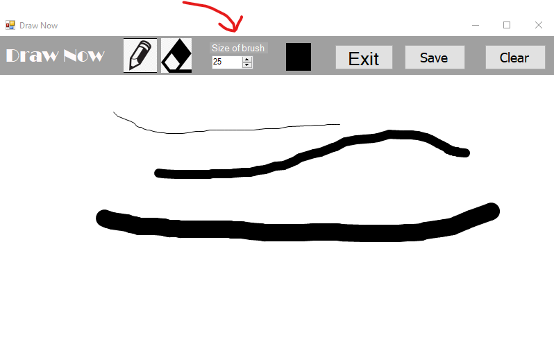

# COA-midterm-project

## Draw Now App

> This app is based to paint app and allows to draw, save, and clear like other similar applications. 

It's pretty simple in usage, so you can open it and easily use for your purpose.

## Here is description
# Image 1 : App Looks Like

> The image below is how the app looks.
-----------------------------------------------------------------------------------

# Image 2 : Use case

> Here is one of use cases of app, it's about drawing(handwriting) of questions.
-----------------------------------------------------------------------------------

# Image 3 : Color Picking

> In the app you can pick the color you want.
-----------------------------------------------------------------------------------

# Image 4 : Brush Size

> You also can choose the size of brush(pencil). 
-----------------------------------------------------------------------------------

# Image 5 : Eraser

> It's a eraser to clean if you make mistake.
-----------------------------------------------------------------------------------

# Image 5 : Clear

> You can clean all picture if you want.
-----------------------------------------------------------------------------------

# Image 5 : Exit

> To close the app you need to click the 'exit' button 
-----------------------------------------------------------------------------------

# Image 5 : Save File

> After you finish your task you can save your work, by clicking 'save' button, after will appeare the file manager window, there you can write the name of file and save. 
-----------------------------------------------------------------------------------
